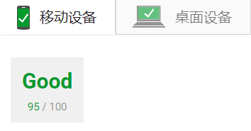

Udacity P8

#### Part 1: 优化 index.html 的 PageSpeed Insights 得分
- 首先先阅读评审要求
- ok，我们已经看过要求了，那么先在github里生成一个可访问的链接
- 在谷歌家的[PageSpeed Insights](https://www.google.com/url?sa=t&rct=j&q=&esrc=s&source=web&cd=2&cad=rja&uact=8&ved=0ahUKEwi7n6axmOrVAhVQ4GMKHUhHDCwQjBAIPzAB&url=https%3A%2F%2Fdevelopers.google.com%2Fspeed%2Fpagespeed%2Finsights%2F%3Fhl%3Dzh-CN&usg=AFQjCNFzptm-kH3PDYdnjoONlz-qmRw96g)里测试一下，获得性能提升意见。
- 我们看到了三个建议：图片优化，清除阻止呈现的 JavaScript 和 CSS，使用浏览器缓存。
- 先优化图片吧
	- 按谷歌的建议找到了名为`jpegcrop`的jpg压缩软件，虽然成功运行了，但得到的图片并不能正常打开
	- 直接使用画图工具修改图片的到了一个压缩率大约在70%~80%的同等大小图片，不够出色
	- 还是在pagespeed insight里我发现了可以直接下载谷歌已经提供的优化文件，包括图片和js文件，压缩率良好。就直接使用了。
- 在css的处理上使用媒体查询使得打印样式不被加载。同时将主样式直接插入HTML文本。
- 删除了网络字体
- 对异步的脚本使用async ，统一放到body后面。
- 对于浏览器缓存我看了一下[谷歌的文档](https://developers.google.com/speed/docs/insights/LeverageBrowserCaching)，发现并不知道怎么操作，论坛里也有相关讨论[页面部署在GitHub Pages时，如何设置缓存控制](https://discussions.youdaxue.com/t/github-pages/36990),然而我没有做这一步也已经达到了要求

- 其它有用的链接:
	- [设置html页面缓存方法](http://www.cnblogs.com/MrZouJian/p/5573326.html)
	- [网站优化内容小结](https://discussions.youdaxue.com/t/topic/43915)
	

#### Part 2: 优化 pizza.html 的 FPS（每秒帧数）
- 照常是要先看要求的。
- chrome已经和教程里的chrome不一样了[开发者工具](https://discussions.youdaxue.com/t/chrome-59-x/43792)
- 录制timeline，发现强制同步布局，跟踪到具体的js脚本，发现问题所在：
	- 遍历披萨的元素并改变它们的宽度
	- 基于滚动条位置移动背景中的披萨滑窗
	- 当页面加载时生成披萨滑窗
- 把可以初始获取的项目移出loop
- 更改选择器选择方法为getElementByClassName
- 在css里的.mover添加属性will-change: transform;  

就是这样
